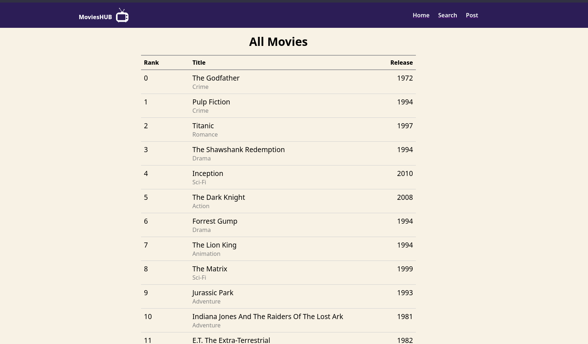

# Movie HUB - MERN Stack based application

> This web-application is built as a backend project to demonstate the use of REST API in general. It covers following points :-
### 1. I've created a Navbar having three buttons: HOME , SEARCH, POST

### 2. HOME :- This frontend page uses GET api to fetch movies using pagination. Each pagination can hold upto 10 entries.

### 3. SEARCH :- This page frontend has two parts:- GET movie by :id ; GET all movies at once.

### 4. POST :- This page uses POST api to add movues into database.

 
 
 
> Note: This project was made by me as a backend assignment